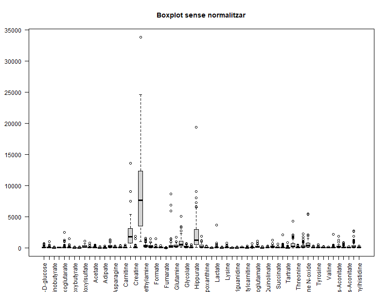
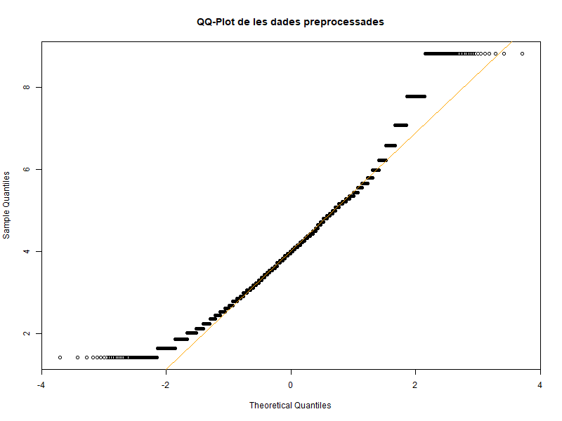
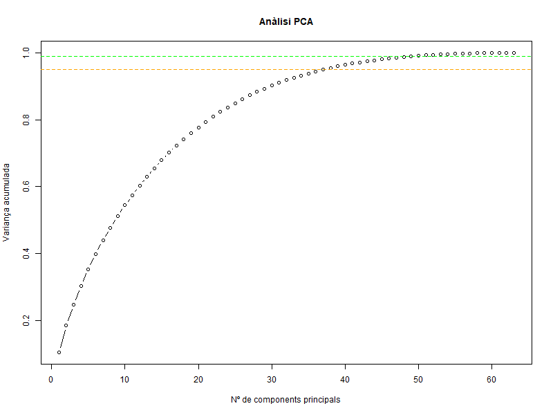
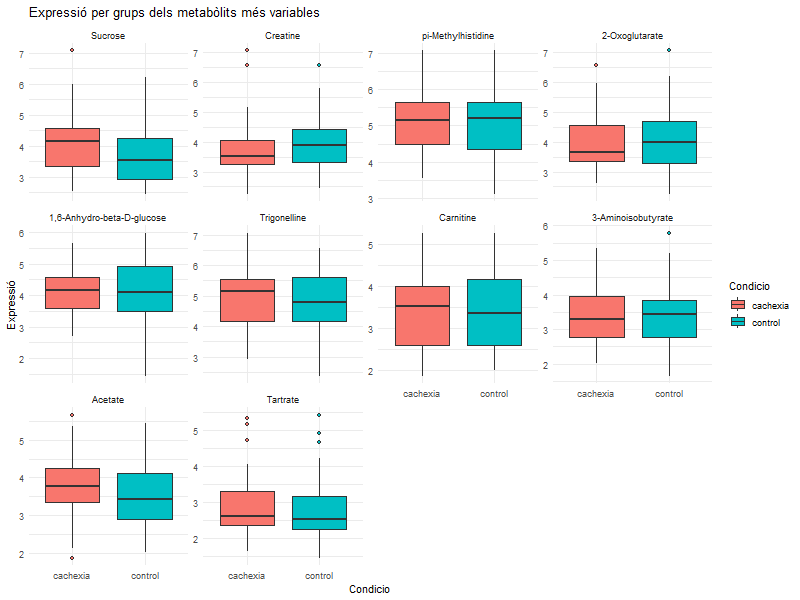

# 1. Resum

La caquèxia és una malaltia causada per la pèrdua considerable de massa muscular i greix. Es un signe de desnutrició que ocorre perquè l’organisme utilitza els nutrients  de forma diferent degut a diversos factors com la inflamació o un augment del metabolisme [2].

Aquest estudi [1] compara els perfils metabòlics d’individus malalts de caquèxia enfront a un grup control  d’individus sans, analitzant 63 variables (metabòlits) en 77 mostres. 

L'objectiu principal és identificar diferències significatives en els perfils metabòlics que puguin explicar l'aparició i progressió de la malaltia. Per a fer-ho s’empreen tècniques avançades de bioinformática i bioestadística per a explorar les dades i avaluar els metabòlits.

Encara que no s’observen moltes diferències entre ambdues condicions, l'aplicació d'una anàlisi multivariant (sPLS-DA) mostra tres metabòlits diferencialment expressats en els individus amb caquèxia: la Sucrosa, la Metilamina i el Triptòfan. 

Els resultats suggereixen que aquestes tres variables metabòliques podrien exercir un paper clau en la diferenciació entre ambdós grups, essent biomarcadors potencials per la malaltia de la caquèxia.

En conclusió, l'estudi remarca la necessitat de conèixer les diferències en l’expressió dels metabòlits, per establir perfils i patrons que ajudin a comprendre la malaltia i posteriorment a millorar el diagnòstic i el seu tractament. 


# 2. Objectius

L’objectiu bàsic d’aquest anàlisi és explorar i interpretar les dades metabòliques de pacients amb caquèxia front a individus sans (control), per a avaluar les diferències en els perfils metabòlics entre aquests i identificant metabòlits diferencialment expressats entre pacients de caquèxia i individus sans localitzant possibles biomarcadors associats a la malaltia de la caquèxia.

Per altra banda, és interessant perquè al caracteritzar el perfil metabòlic dels individus que pateixen caquèxia es recopila informació que pot resultar molt útil per la comprensió de la malaltia.

Per tant, fent ús d’eines bioinformàtiques i bioestadístiques es pretén visualitzar de forma integra els resultats per detectar patrons i  metabòlits que puguin diferenciar les dues condicions.

Per a poder assolir aquest propòsit global, es defineixen els següents objectius:

-	Organitzar i estructurar les dades per al seu anàlisi.

-	Preprocessar les dades per assegurar que es poden comparar entre mostres.

-	Realitzar un anàlisi exploratori de les dades incloent l’ús de l’estadística descriptiva, l’anàlisi de components principals (PCA) i diverses representacions de les dades.

-	Realitzar un anàlisi estadístic senzill per avaluar els metabòlits que mostren diferències significatives entre grups.

-	Realitzar un anàlisi multivariant per identificar els metabòlits més rellevants en la comparació entre grups.


# 3. Mètodes

## 3.1. Obtenció i estructura de les dades

Les dades *(human_cachexia.csv)*es van obtenir d’un Repositori de GitHub [3]. Aquestes dades contenen informació metabolómica de pacients amb caquèxia i individus controls. Des de GitHub informen que les mostres no estan aparellades, que hi ha dos grups (individus control i amb caquèxia), que tots els valors són numèrics i que no s’han detectat valors faltants (missing values).

Per al seu anàlisi, les dades van ser organitzades en tres components:

-	Dades d’expressió: Afegint els valors dels metabòlits  com a matriu (*as.matrix()*) transposada per a poder obtenir els metabòlits en files i les mostres en columnes.

-	Metadades: 

De fila (*rowData*): Informació sobre els metabòlits.

De columna (*colData*): Informació sobre les mostres, incloent si pertanyen al control o són pacients de caquèxia.
  
Amb aquesta informació es fa un *SummarizedExperiment*, que consisteix en una estructura de dades en forma de matriu que s’utilitza per guardar dades experimentals biològiques i les seves corresponents metadades amb la funció *SummarizedExperiment()* de Bioconductor. Aquest objecte és molt usat en anàlisi de dades òmiques perquè facilita el tractament conjunt de dades i metadades [4].

## 3.2. Preprocessament de les dades

Per a realitzar un bon preprocessament de les dades primer s’observa la distribució d’aquestes mitjançant un diagrama de caixes amb la funció *boxplot ()* i es cerca la presencia d’outliers en base a la distància de cada mostra al centre. Amb la funció *matrixStats::colmeans2(x^2)* es calcula el centroide de les dades, fent una aproximació de la distancia Euclidiana [5], es defineix com un outlier l’1% de les mostres més allunyades del centre calculat i s’extreuen els outliers, per eliminar-los i que no interfereixin en els resultats.

Durant aquest anàlisi es van dur a terme dues etapes de preprocessament:

-	Transformació logarítmica: Amb la funció *log1p()* es va realitzar una transformació logarítmica de les dades per a poder reduir l’asimetria d'aquestes i normalitzar la variança modificant l’escala de les dades [6].

-	Normalització per quantils: Amb la funció *normalize_quantils()* es normalitza una matriu fent que totes les seves columnes tinguin la mateixa distribució. Es calculen els rangs amb la funció *rank ()*, s’ordenen els valors amb *sort()* i es fa un promig  de la posició amb *apply()* y *mean*. Això fa que sigui comparable entre les diferents mostres i poder fer una millor interpretació de les dades [7].

## 3.3. Control de qualitat

Després del preprocessament es realitza un control de qualitat per validar l’impacte del preprocessament en les dades. Per fer-ho, es fan diverses representacions gràfiques:

-	Diagrama de caixes amb la funció *boxplot()*.

-	Histograma per analitzar la distribució global de les dades d’expressió amb la funció *hist()*.

-	QQ-Plot per a comprobar la normalitat dels residus de les dades transformades amb *qqnorm()* i *qqline()*.

Un cop finalitzat el preprocessament de les dades i passat el control de qualitat es pot iniciar l’anàlisi exploratori d’aquestes.

## 3.4. Anàlisi exploratori

S’inicia l’anàlisi calculant les mitjanes (*rowMeans())* i variançes *(apply(, 1, var))*de cada metabólit i es crea un document on s’ordenen del més variable al que menys, per a poder observar, quins metabòlits varien més en el conjunt de mostres, per si poden tenir rellevància biológica.

Seguidament, es realitza un anàlisi de components principals (PCA) [8] utilitzant la funció *prcomp()* per a reduir la dimensionalitat de les dades, preservant la major part de la variança. El criteri més usat en bioinformàtica es conservar el número mínim (principal) de components que expliquin un 95% de la variança en els metabòlits entre sans o malalts de caquèxia.

A continuació es representa un Heatmap per a poder observar els 20 metabòlits més variables amb la funció *pheatmap()* [9].

Seguidament, es fa una recerca per detectar agrupaments de les dades de forma visual mitjançant un Clustering jeràrquic de les mostres amb la funció *hclust()* [10].

Per últim, es fa diagrames de caixes (*ggplot() + geom_boxplot()*) dels 10 metabòlits més variables per a comparar les seves expressions entre individus sans i caquèxics.

## 3.5. Anàlisi estadístic

Per identificar metabòlits diferencialment expressats entre els individus sans (control) i els malalts de caquèxia s’aplica una t'Student amb la funció *t.test()* per a cada metabòlit de forma independent [11]. Es suposa normalitat per el QQplot visualitzat i el tamany de les dades pel teorema central del límit [12].

## 3.6. Anàlisi multivariant

S’aplica un model sPLS-DA (sparse Partial Least Squares) amb la funció *splsda* del paquet de *mixOmics* [13]. Aquest model permet identificar els metabòlits més rellevants en la separació de les mostres segons la condició (control i caquèxics). Es a dir, amplifica les diferències en l’expressió d’aquests metabòlits entre els dos grups. 

Es grafiquen els resultats d’aquest anàlisi amb un Biplot, una representació dels metabòlits i les mostres (*plotVar()*)i un plot de càrreges (*selectVar*) on s’ordenen les variables que causen més separació en funció de la rellevància en aquesta separació.

# 4. Resultats

El present estudi té com a base un conjunt de dades metabòliques de mostres humanes separades en dues condicions: control i caquèxia. 

## 4.1. Obtenció i estructura de les dades

L’arxiu *human_cachexia.csv* es carrega correctament i es divideix en dos components:

- Una matriu d’expressió: amb dades quantitatives de 63 metabòlits i 77 mostres (pacients).

- Un conjunt de metadades incloent la variable categòrica condition (grups) i patient ID.

Per assegurar un bon anàlisi de les dades, es construeix un objecte de classe *SummarizedExperiment*. Aquest objecte agrupa les dades d’expressió i les metadades en una única estructura (es pot trobar en format .Rda a GitHub: Paricio-Navas-Maria-PEC [1]).

L’objecte *SummarizedExperiment* és similar al tradicional *ExpressionSet*, tot i que *SummarizedExperiment* ha demostrat ser més flexible, versàtil, millor documentat i compatible amb nous paquets de R com edgeR o DESeq2.  Permet múltiples assays i facilita l’accès a dades mitjançant funcions intuïtives com *assay(), rowData() i colData()*. A més, Bioconductor el recomana de forma estàndard en l’actualitat [4].

Aquest objecte conté a les columnes les mostres (els diferents individus) i a les files els metabòlits (1,6-Anydro-beta-D-glucosa, 1-Methylnicotinamida, etc.). S’observa que té una dimensió de 63 x 77, el que encaixa amb les dades. 

## 4.2. Preprocessament de les dades

Per a dur a terme un bon preprocessament de les dades, primer es realitza un resum estadístic del *SummarizedExperiment* transposat (que havia estat transposat prèviament) per a poder observar les tendències de les dades. S’observa una gran variabilitat entre mostres per a tots els metabòlits, observant molta diferència entre el valor mínim i el màxim d’expressió de cada metabòlit, com es pot veure al diagrama de caixes de la Figura 1, on s’aprecia que les mitjanes es troben a nivells molt diferents, indicant que les dades no estaven normalitzades.

```{r, echo=FALSE, out.width="50%", fig.align="center", fig.cap="Diagrama de caixes que mostra les dades de “caquèxia” en cru "}

```

Per a estabilitzar la variança i suavitzar les diferències en els nivells d’expressió s’aplica una transformació logarítmica del tipus log(x+1) i es cerca la presència d’outliers que puguin alterar de forma significativa els resultats. 

Es troba que del metabòlit “Taurina” hi ha un outlier de valor 50. S’elimina aquest valor per a que no distorsioni els resultats .

Finalment, es practica una normalització de les dades per quantils.

## 4.3. Control de qualitat

Després del preprocessament de les dades, és de vital importància dur a terme un control de qualitat per a comprovar que les dades estan llestes per a treballar.

En el control de qualitat es tornen a graficar mitjançant un diagrama de caixes després de la transformació i la normalització d’aquestes (Figura 2A) i es representa un histograma dels valors d’expressió després de la transformació logarítmica i la normalització que serveix per a poder obtenir informació sobre la distribució global de les dades (Figura 2B). 

```{r, echo=FALSE, out.width="30%", fig.show="hold", fig.align="center", fig.cap="A) Diagrama de caixes després de la transformació logarítmica i la normalització; B) Histograma dels valors d'expressió dels metabòlits amb les dades preprocessades "}
knitr::include_graphics(c("grafic2.png", "grafic3.png"))
```

Com es pot observar a la Figura 2A, les variançes i les mitjanes queden més homogènies i estabilitzades. Ja no es contempla asimetria en les dades i per tant estan llestes per a ser analitzades. A la Figura 2B es pot observar que es redueixen els valors extrems que eren presents de forma prèvia a la transformació/normalització. A més,  s’aprecia una forma aproximadament simètrica, és a dir, que les dades després de ser preprocessades s’apropen a una distribució normal, encara que no perfecta. S’observa certa asimetria amb una cua a la dreta, però molt més controlada que a l’inici. 

Per últim, es comprova que la distribució s’apropa a la normalitat mitjançant un QQ-plot (Figura 3) per, si s’escau, aplicar un anàlisi paramètric en un futur com un anàlisi estadístic amb t d’Student.

```{r, echo=FALSE, out.width="50%",  fig.align="center", fig.cap="QQ-plot de les dades preprocessades per a valorar la normalitat "}

```
## 4.4. Anàlisi exploratori

Un cop transformades i normalitzades les dades, s’inicia un anàlisi exploratori de les mateixes, començant per l’estadística descriptiva: calculant les mitjanes i variançes de cada metabòlit.

S’observa que els metabòlits més variables  entre els individus (sense diferenciar entre grups) són: Creatina,  Sacarosa, 2-Oxoglutarat, pi-Metilhistidina,1,6-Anhidro-beta-D-glucosa, Trigonelina, Carnitina, 3-Aminoisobutirat, Acetat i Tartrat amb variançes entre 0.94 i 0.74. 

Mitjançant un anàlisi de components principals (PCA) es permet explorar l’agrupació natural de les mostres. Cada component principal (PC) és una nova variable que prové de la combinació lineal dels metabòlits. En aquest cas, com s’observa a la Figura 4 (marcat en taronja) s’accepta un PC38 que permet reduir les dades de 63 metabòlits a 38 components sense perdre més del 5% de l’informació, és a dir amb el 95% de la variança explicada. 

```{r, echo=FALSE, out.width="50%", fig.align="center", fig.cap="Anàlisi de Components Principals (PCA)"}

```
En l’anàlisi de PCA es determina també que els metabòlits que més contribueixen a la variança total són: Acetate, Threonine, 2-Oxoglutarate, 4-Hydroxyphenylacetate, Citrate, Sucrosa, trans-Aconitate, Glutamine, Glycine i Hippurate.

Posteriorment es representen els 10 metabólits més variables mitjançant un heatmap resaltant la diferència d’expressió entre mostres (Figura 5A) i  un anàlisi de clustering jeràrquic sobre els metabòlits, utilitzant la distància euclidiana com a mètrica i el mètode d'enllaç mitjà (average linkage) per a agrupar (Figura 5B).

```{r, echo=FALSE, out.width="30%", fig.show="hold", fig.align="center", fig.cap="A) Heatmap dels 10 metabòlits més variables; B) Anàlisi de l’agrupació dels metabòlits"}
knitr::include_graphics(c("grafic6.png", "grafic7.png"))
```

El heatmap (Figura 5A) no mostra patrons evidents d’expressió entre mostres amb aquests metabòlits que permetin agrupar-los en un perfil metabòlic en funció del grup (control o pacients de caquèxia).

El dendrograma resultant (Figura 5B) mostra com uns certs metabòlits presenten perfils d'expressió similars, agrupant-se en branques comunes. Aquesta agrupació suggereix l'existència de patrons de coexpressió o possibles funcions relacionades entre metabòlits.

Es generen diagrames de caixes individuals (Figura 6) per als metabòlits més variables entre les condicions d'estudi (control i caquèxia), amb l'objectiu de visualitzar les possibles diferències en el seu nivell d'expressió.

```{r, echo=FALSE, out.width="40%", fig.align="center", fig.cap="Diferències en el nivell d’expressió dels metabòlits més variables entre els individus control i els pacients de caquèxia"}

```

En general, no es mostra una separació clara i consistent entre grups pels metabòlits seleccionats, la qual cosa suggereix que, encara que presenten alta variància global, això no sempre es tradueix en una diferència significativa entre condicions.

## 4.5. Anàlisi estadístic

Per a identificar metabòlits que presenten diferències significatives entre pacients que pateixen caquèxia i els individus controls, es realitza una prova t d’Student independent per a cada metabòlit. Aquesta prova permet comparar si les mitjanes dels dos grups independents presenten diferències estadísticament significatives suposant normalitat de les dades i homocedasticitat (variances constants).

A la Taula 1 s’observen els p-valors associats a cada metabòlit juntament amb les mitjanes de l’expressió en els dos grups (caquèxics i controls).
Dels metabòlits analitzats, es presenten diferències estadísticament significatives entre individus control i pacients de caquèxia per la Metilamina, el Triptòfan i la Sucrosa amb un 95% de significància.  

```{r}
# Taula 1. Metabòlits més variants entre condicions segons una prova t d’Student
resultats_ttest <- read.csv("resultats_ttest.csv")
resultats_ttest <- resultats_ttest[order(resultats_ttest$p_value), ] 
head(resultats_ttest, 5)
```

## 4.6. Anàlisi multivariant
Complementàriament, s'aplica una anàlisi sPLS-DA (Sparse Partial Least Squares Discriminant Analysis), una tècnica supervisada que busca els components que millor separin els grups a partir dels metabòlits.

La Figura 7A mostra una clara separació entre tots dos grups (controls i amb caquèxia). Aquest gràfic mostra les diferències generals entre mostres, és a dir, individus que tenen perfils metabòlics diferents i que podrien correspondre a patrons d'expressió que diferencien als caquèxics dels controls. En canvi, la Figura 7B representa un Biplot de sPLS-DA que mostra els metabòlits (punts blaus), contra més allunyats es trobin del centre, tenen un major efecte en les diferències entre els perfils metabòlics d’ambdós grups.

```{r, echo=FALSE, out.width="30%", fig.show="hold", fig.align="center", fig.cap="A) Separació entre individus controls(blau) i amb caquèxia (taronja) en funció del perfil metabòlic; B) Diferències d’expressió entre condicions dels metabòlits (blau)"}
knitr::include_graphics(c("grafic9.png", "grafic10.png"))
```
A més, en extreure les càrregues (loadings) del model sPLS-DA s’identifiquen els metabòlits més rellevants en la discriminació entre condicions. Els 5 principals metabòlits que diferencien els perfils metabòlics de pacients de caquèxia i control són els mostrats en la Taula 2: Sucrosa, Triptòfan i Metilamina.

```{r}
# Taula 2. Metabòlits més importants en la separació entre condicions per sPLS-DA
metab_import_ordre <- read.csv("metab_import_ordre.csv")
head(metab_import_ordre, 5)
```


# 5. Discussió

El present estudi ha tingut com a objectiu principal la caracterització del perfil metabòlic de pacients amb caquèxia humana en comparació amb subjectes sans, utilitzant eines bioinformàtiques i estadístiques adaptades a l'anàlisi de dades ómiques.  L’anàlisi no té només com a objectiu establir les diferències entre els perfils metabòlics d’ambdós grups, sino també identificar metabòlits que podrien ser possibles biomarcadors. A partir de l'ús de l'objecte *SummarizedExperiment*, s'ha establert un pipeline reproduïble que inclou un preprocessament de les dades, una anàlisi exploratoria, un analísi estadístic i un de multivariant. 

Des del punt de vista biològic, els resultats mostren metabòlits que presenten més variabilitat entre mostres com la Sucrosa i el 2-Oxoglutarat. No obstant, gràcies al anàlisi univariant (t d’Student) reforçat per l’anàlisi multivariant (sPLS-DA) es detecten diferències significatives entre els individus controls i caquèxics en els seus perfils metabòlics amb l'expressió de tres metabòlits: la Metilamina, el Triptòfan i la Sucrosa, aquest fet podria indicar alteracions en rutes metabòliques específiques relacionades amb la malaltia de la caquèxia. Segons KEGG [14] els tres metabòlits comparteixen vies metabòliques generals, pero no s’observa cap d’específica.

El model de l’anàlisi multivariant sPLS-DA empreat ha conseguit també separar les mostres de manera clara segons la condició clínica ressaltant que són els metabòlits que  han contribuit en major mesura a aquesta diferenciació. 

Malgrat aquestes troballes, és important assenyalar que aquest estudi té limitacions.
Una de les principals limitacions de l'estudi radica en el nombre de mostres disponibles. Encara que es compta amb una quantitat raonable de pacients, continua sent reduïda en comparació amb l'alta dimensionalitat del conjunt de dades (63 metabòlits), la qual cosa pot limitar la potència estadística d'algunes anàlisis. Aquest desequilibri és un problema comú en estudis ómics i pot propiciar conclusions errònies (falsos negatius o resultats inestables amb lleugers canvis en el preprocessament, entre d’altres).
Altres limitacions metodológiques que s’haurien de considerar són d’una banda els anàlisi amb proves t d’Student. Aquests anàlisi podrien estar subjectes a errors de tipus I, el que implica el risc d’interpretar diferències en metabòlits entre grups que en realitat no existeixen (tot i que es confirmin emb el model multivariant). Per a evitar aquest risc, es podria ampliar l’estudi mitjançant anàlisis complementaris que reforçin la validesa estadística dels resultats.  D’altra banda, el model supervisat sPLS-DA es propens a l’overfitting, per tant, per extreure conclusions més fiables que es puguin extrapolar a altres contextos es podria ampliar l’estudi amb diversos métodes de validació (validació creuada, ús de dades externes, etc). 

És important remarcar que aquest estudi no permet conclusions exactes. Els resultats s’han d’interpretar com a hipòtesis generades a partir de dades, que requereixen estudis amb més participants i/o validació experimental adicional amb dades clíniques i ómiques. Aquests anàlisi podrien validar l’efecte de l’expressió diferencial d’aquests tres metabòlits (Metilamina, Sucrosa i Triptòfan) en ambdues condicions, per confirmar el seu paper funcional en la malaltia de la caquèxia.

# 6. Conclusions

Durant aquest anàlisi s’han explorat i interpretat les dades metabòliques d’individus sans i pacients amb la malaltia de la caquèxia. Els objectius eren, d’una banda, avaluar les diferències entre els seus perfils metabòlics localitzant metabòlits diferencialment expressats entre ells per identificar biomarcadors potencials associats a la malaltia i d’altra banda, caracteritzar el perfil metabòlic per a millorar la comprensió d’aquesta.

En aquest estudi s’ha identificat diferències rellevants en els perfils d’expressió de tres metabòlits entre uns individus sans i uns pacients amb caquèxia, mitjançant l’ús de tècniques de bioinformàtica i bioestadística.

En concret, s’ha observat diferències significatives per un nivell de significància del 95% de l’expressió de: la Sucrosa, la Metilamina i el Triptòfan.

Els tres compostos participen en vies metabòliques generals, però en aquest estudi no s’observa la convergència dels tres metabòlits en cap via específica.

Seria necessari dur a terme estudis clínics amb més participants i ampliar l’anàlisi per a poder establir aquests metabòlits diferencialment expressats com a possibles biomarcadors. 

L’identificació de metabòlits com a biomarcadors potencials de la caquèxia obre la porta a noves estratègies diagnòstiques i terapèutiques pels seus pacients.

# 7. Referències
1. Repositori de GitHub d'aquest anàlisi: https://github.com/MariaPNav/Paricio-Navas-Maria-PEC1 

2.	National Cancer Institute. Caquexia: https://www.cancer.gov/espanol/publicaciones/diccionarios/diccionario-cancer/def/caquexia

3.	GitHub. nutrimetabolomics/metaboData: https://github.com/nutrimetabolomics/metaboData 

4.	Bioconductor. SummarizedExperiment: https://www.bioconductor.org/packages/release/bioc/html/SummarizedExperiment.html 

5.	R Core Team. matrixStats: Functions that Apply to Rows and Columns of Matrices (and to Vectors): https://cran.r-project.org/web/packages/matrixStats/matrixStats.pdf 

6.	RDocumentation. log1p: https://www.rdocumentation.org/packages/SparkR/versions/2.1.2/topics/log1p

7.	Sanderson, S. P. (2024). Exploring data with R: https://www.spsanderson.com/steveondata/posts/2024-03-28/index.html


8.	Gil, C. PCA en R: https://rpubs.com/cristina_gil/pca 

9.	RDocumentation. pheatmap: https://www.rdocumentation.org/packages/pheatmap/versions/1.0.12/topics/pheatmap 

10.	Arquez, M. PCA Example in R: https://rpubs.com/arquez9512/597881

11.	R-Coder. Prueba t en R: https://r-coder.com/t-test-en-r/ 

12.	Revista Seden. Capítulo 8: chrome-extension://efaidnbmnnnibpcajpcglclefindmkaj/https://www.revistaseden.org/files/8-CAP%208.pdf 

13.	MixOmics. Método sPLS-DA: https://mixomics.org/methods/spls-da/

14.	KEGG. Pathway map01100: https://www.kegg.jp/pathway/map01100+C00218 


